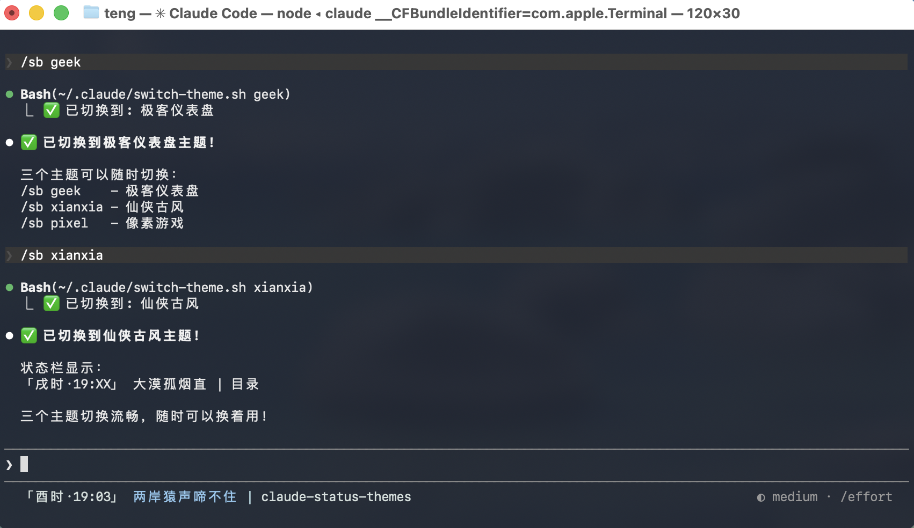
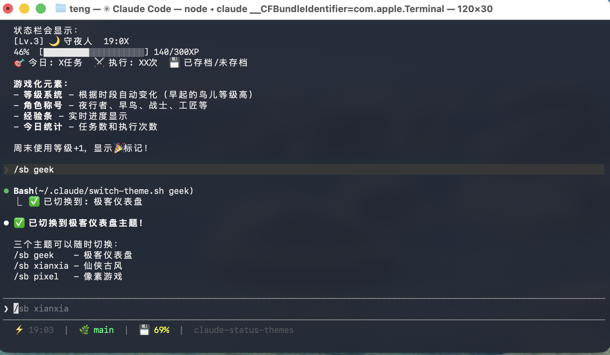
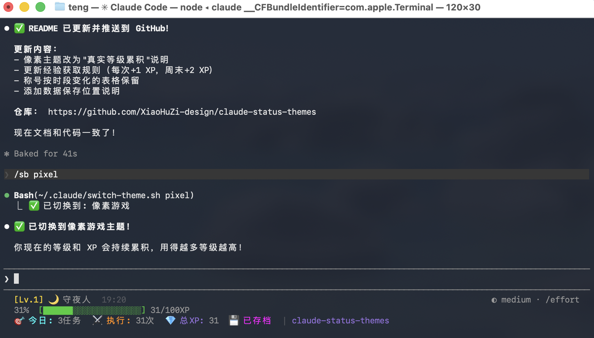

# Claude Code 状态栏主题

> 为 Claude Code 定制的状态栏主题：仙侠古风 + 极客仪表盘 + 像素游戏


## 主题预览

### 仙侠古风

**效果展示：**


**文本预览：**
```
「申时·16:30」 清泉石上流 | project
```

**特色功能：**
- 十二时辰制
- 144句古诗词按时辰轮换
- 月白/青瓷/茉莉配色

### 极客仪表盘

**效果展示：**


**文本预览：**
```
⚡ 16:30  |  🌿 main*  |  💾 45%
```

**特色功能：**
- Git 分支状态（*表示有修改）
- 内存使用率（按占用变色）
- CPU 进度条（高于30%显示）
- Node/Python 版本检测

### 像素游戏

**效果展示：**


**文本预览：**
```
[Lv.3] 🌙 守夜人  19:00
46%  [█████████░░░░░░░░░░░] 140/300XP
🎯 今日: 5任务  ⚔️ 执行: 42次  💾 已存档
```

**特色功能：**
- 真实等级累积（每100 XP升一级）
- 经验值进度条（每次使用+1 XP）
- 今日任务/执行统计
- 角色称号（按时段变化：夜行者、早鸟、战士等）
- 数据持久化保存

## 快速安装

### 一键安装

```bash
curl -sSL https://raw.githubusercontent.com/XiaoHuZi-design/claude-status-themes/main/install.sh | bash
```

### 手动安装

**1. 复制脚本**
```bash
cp statusline-*.sh ~/.claude/
cp switch-theme.sh ~/.claude/
```

**2. 复制 skill**
```bash
cp -r sb ~/.claude/skills/
```

**3. 配置 settings.json**
```json
{
  "statusLine": {
    "type": "command",
    "command": "bash ~/.claude/statusline-geek.sh"
  },
  "spinnerVerbs": {
    "mode": "replace",
    "verbs": ["灌注真元", "神识推演", ...]
  }
}
```

## 使用方法

### 斜杠命令切换

重启 Claude Code 后：
```
/sb geek      # 极客仪表盘
/sb xianxia   # 仙侠古风
/sb pixel     # 像素游戏
/sb g/x/p     # 简写
```

### 脚本切换

```bash
~/.claude/switch-theme.sh geek     # 极客
~/.claude/switch-theme.sh xianxia  # 仙侠
~/.claude/switch-theme.sh pixel    # 像素
```

## 主题配置

### 仙侠古风

| 元素 | 说明 |
|------|------|
| 时辰 | 子丑寅卯辰巳午未申酉戌 |
| 诗句 | 144句，每5分钟轮换 |
| 配色 | 月白 #D4E0DD / 青瓷 #90C9F0 |

### 极客仪表盘

| 元素 | 说明 |
|------|------|
| Git | 🌿干净 / 🔥有修改 |
| 内存 | 绿<50% / 黄<80% / 洋红≥80% |
| CPU | 进度条，高于30%显示 |

### 像素游戏

| 元素 | 说明 |
|------|------|
| 等级 | 真实累积，每100 XP升一级 |
| 经验 | 每次使用+1 XP，周末+2 XP |
| 称号 | 按时段变化（见下方） |
| 数据 | 保存在 `~/.claude/pixel-stats.json` |

**角色称号（按时段变化）：**
- 0-5点: 🦇 夜行者 | 6-8点: 🌅 早鸟
- 9-11点: ⚔️ 战士 | 12-15点: 🔨 工匠
- 16-18点: 📜 学者 | 19-20点: 🌙 守夜人
- 21-23点: 💤 修行中

*周末使用显示🎉标记，经验值翻倍*

## 文件结构

```
claude-status-themes/
├── README.md
├── xianxia.png              # 仙侠主题截图
├── geek.png                 # 极客主题截图
├── pixel.png                # 像素主题截图
├── statusline-xianxia.sh    # 仙侠主题
├── statusline-geek.sh       # 极客主题
├── statusline-pixel.sh      # 像素游戏主题
├── switch-theme.sh          # 切换脚本
├── spinner-verbs.json       # 过程状态词
├── sb/
│   └── SKILL.md             # 斜杠命令
└── install.sh               # 安装脚本
```

## 卸载

删除 `settings.json` 中的 `statusLine` 和 `spinnerVerbs` 配置。

## License

MIT
